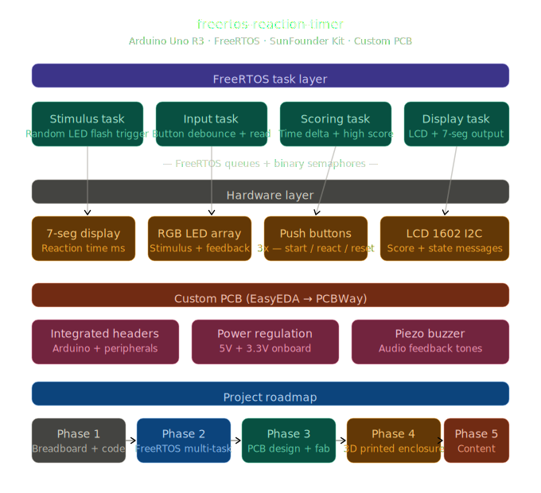

# rtos-hrt-firmware

[](https://platformio.org/)
[](https://freertos.org/)
[](https://stm32-base.org/boards/STM32F411CEU6-WeAct-Black-Pill-V2.0)
[](https://www.pcbway.com/)
[](LICENSE)

> A multi-task human reaction timer built on the STM32F411 Black Pill with FreeRTOS. Four concurrent tasks communicate via queues and binary semaphores to deliver microsecond-accurate reaction timing, flash high-score persistence, RGB LED stimulus output, piezo audio feedback, and LCD 1602 display output — with a 3.5" ILI9488 TFT upgrade planned for Phase 2.

---

## Table of contents

- [Overview](#overview)
- [Hardware](#hardware)
- [FreeRTOS architecture](#freertos-architecture)
- [Pin configuration](#pin-configuration)
- [Getting started](#getting-started)
- [PCB design](#pcb-design)
- [3D enclosure](#3d-enclosure)
- [Roadmap](#roadmap)
- [License](#license)

---

## Overview

`rtos-hrt-firmware` measures human reaction time with microsecond precision using a real-time multi-task architecture built on FreeRTOS. A randomized stimulus interval — modulated by a potentiometer — fires an RGB LED; the player responds with a button press captured via hardware interrupt on the STM32F411's NVIC. Four isolated FreeRTOS tasks handle stimulus generation, input capture, scoring logic, and display output, communicating exclusively through queues and binary semaphores.

The STM32F411 Black Pill runs at 100MHz with 128KB RAM and 512KB Flash — representative of the class of ARM Cortex-M4 microcontrollers used in professional embedded systems development.

This is the second project in the [Baremetal Labs](https://github.com/gmahfood) embedded systems portfolio, following [`dht11-fsm-dashboard`](https://github.com/gmahfood/dht11-fsm-dashboard).

---

## Hardware

### Microcontroller specifications

| Parameter | Value |
|-----------|-------|
| MCU | STM32F411CEU6 |
| Core | ARM Cortex-M4 with FPU |
| Clock | 100MHz |
| Flash | 512KB |
| RAM | 128KB |
| GPIO | 36 pins |
| Timers | 8 (including 2x advanced) |
| Programmer | HiLetgo ST-Link V2 via SWD |

### Bill of materials

| Ref | Component | Value / Part | Phase | Source |
|-----|-----------|--------------|-------|--------|
| U1 | Microcontroller | STM32F411 Black Pill | 1 | Amazon |
| PROG1 | Programmer / debugger | HiLetgo ST-Link V2 | 1 | Amazon |
| LCD1 | LCD display | 1602 I2C (0x27) | 1 prototype | SunFounder Inventor Kit |
| DSP1 | TFT display | 3.5" ILI9488 480x320 SPI | 2 upgrade | Amazon |
| LED1 | RGB LED | Common cathode | 1 | SunFounder Inventor Kit |
| BZ1 | Piezo buzzer | Passive 3.3V | 1 | SunFounder Inventor Kit |
| SW1 | Push button | React — EXTI line | 1 | SunFounder Inventor Kit |
| SW2 | Push button | Start | 1 | SunFounder Inventor Kit |
| SW3 | Push button | Reset | 1 | SunFounder Inventor Kit |
| RV1 | Potentiometer | 10kΩ | 1 | SunFounder Inventor Kit |
| R1–R3 | Current limiting resistors | 220Ω | 1 | SunFounder Inventor Kit |
| J1 | DC barrel jack | 5.5/2.1mm | 3 PCB | — |
| U2 | Voltage regulator | AMS1117-3.3 (SOT-223) | 3 PCB | — |
| D1 | Schottky diode | SS14 | 3 PCB | — |
| C1 | Electrolytic cap | 100µF / 25V | 3 PCB | — |
| C2–C4 | Ceramic bypass cap | 100nF | 3 PCB | — |

---

## FreeRTOS architecture

Four tasks run concurrently under the FreeRTOS scheduler, communicating exclusively through queues and binary semaphores — no direct shared state except the volatile FSM.



### Data flow

```
vStimulusTask ──[ xReactionQueue ]──► vInputTask
                                           │
                                   [ xDisplayQueue ]
                                      │           │
                               vScoringTask   vDisplayTask
```

### Task summary

| Task | Priority | Stack | Responsibility |
|------|----------|-------|----------------|
| `vStimulusTask` | 2 | 256B | Random delay, RGB LED stimulus, post timestamp to queue |
| `vInputTask` | 3 | 256B | EXTI semaphore, debounce, capture response timestamp |
| `vScoringTask` | 2 | 256B | Compute reaction delta, flash high score, buzzer tones |
| `vDisplayTask` | 1 | 512B | Drive LCD 1602 / ILI9488 TFT from display queue |

### Inter-task communication

| Primitive | Type | Between | Purpose |
|-----------|------|---------|---------|
| `xReactionQueue` | Queue | Stimulus → Input | Carries stimulus timestamp |
| `xDisplayQueue` | Queue | Input → Scoring / Display | Carries completed `ReactionEvent_t` |
| `xButtonSemaphore` | Binary semaphore | EXTI ISR → Input task | Signals button press with zero latency |
| `gGameState` | Volatile enum | All tasks | Shared FSM state (`IDLE`, `WAITING`, `STIMULUS`, `RESULT`, `EARLY`, `HIGHSCORE`) |

---

## Pin configuration

> ⚠️ Pin assignments are being finalized as hardware arrives. Full `pin_config.h` will be updated once wiring is confirmed on the bench.

| Pin | Direction | Function |
|-----|-----------|----------|
| PB0 | Input (EXTI0) | React button — hardware interrupt |
| PA1 | Input | Start button (polled) |
| PA2 | Input | Reset button (polled) |
| PB4 | Output (PWM TIM3) | RGB LED — red |
| PB5 | Output (PWM TIM3) | RGB LED — green |
| PB6 | Output (PWM TIM4) | RGB LED — blue |
| PB8 | Output | Piezo buzzer |
| PA4 | Output | SPI1 CS — TFT |
| PA5 | Output | SPI1 SCK |
| PA6 | Input | SPI1 MISO |
| PA7 | Output | SPI1 MOSI |
| PB7 | I2C SDA | LCD 1602 (I2C1) |
| PB6 | I2C SCL | LCD 1602 (I2C1) |
| PA0 | Input (ADC) | Potentiometer — difficulty scaling |

---

## Getting started

> ⚠️ Source files are being added incrementally as the project is built. Check the roadmap below for current status.

### Prerequisites

- [VS Code](https://code.visualstudio.com/) + [PlatformIO extension](https://platformio.org/install/ide?install=vscode)
- STM32F411 Black Pill
- HiLetgo ST-Link V2 + SWD cable
- SunFounder Inventor Kit components listed in BOM
- [STM32CubeIDE](https://www.st.com/en/development-tools/stm32cubeide.html) *(optional — for Udemy course work)*

### ST-Link wiring

```
ST-Link V2    →    Black Pill
SWDIO         →    DIO
SWCLK         →    CLK
GND           →    GND
3.3V          →    3.3V
```

### Clone and build

```bash
git clone https://github.com/gmahfood/rtos-hrt-firmware.git
cd rtos-hrt-firmware
```

Open in VS Code. PlatformIO will automatically install all dependencies defined in `platformio.ini`. Connect ST-Link V2, then:

```bash
pio run                   # build
pio run --target upload   # flash via ST-Link
pio device monitor        # serial output at 115200
```

---

## PCB design

> **Status:** Phase 3 — not started

Custom 2-layer integration PCB designed in EasyEDA and fabricated by [PCBWay](https://www.pcbway.com/). Replaces the breadboard prototype with a permanent soldered board featuring onboard 3.3V regulation, reverse polarity protection, SWD debug header, and labeled test points.

[](https://www.pcbway.com/)

### Board specifications

| Parameter | Value |
|-----------|-------|
| Layers | 2 |
| Dimensions | TBD |
| Thickness | 1.6mm |
| Surface finish | HASL (lead-free) |
| Copper weight | 1oz |
| Soldermask | Green |

Gerber files and EasyEDA source will be added to `/hardware` upon completion of Phase 3.

---

## 3D enclosure

> **Status:** Phase 4 — not started

Parametric enclosure designed in OpenSCAD / CadQuery and printed on Bambu Labs P2S. Features PCB standoffs, button cutouts, LED diffuser window, and TFT display bezel.

| Parameter | Value |
|-----------|-------|
| Printer | Bambu Labs P2S |
| Material | PETG |
| Design tool | OpenSCAD / CadQuery |

STL files and print profiles will be added to `/enclosure` upon completion of Phase 4.

---

## Roadmap

### Phase 1 — breadboard prototype (SunFounder kit + LCD 1602)

- [x] Repository initialized and pushed
- [x] PlatformIO project configured for STM32F411
- [x] `pin_config.h` — STM32 GPIO assignments and timing constants
- [x] `shared_types.h` — FreeRTOS handles, FSM states, event struct
- [ ] `main.cpp` — scheduler init, NVIC ISR, task creation
- [ ] `task_stimulus.cpp` — random delay, LED fire, queue post
- [ ] `task_input.cpp` — EXTI semaphore, debounce, timestamp capture
- [ ] `task_scoring.cpp` — flash high score, buzzer tones
- [ ] `task_display.cpp` — LCD 1602 state rendering
- [ ] ST-Link wired and board flashing confirmed
- [ ] Breadboard wiring complete
- [ ] Serial monitor output verified
- [ ] Reaction timing accuracy validated

### Phase 2 — FreeRTOS refinement + TFT display upgrade

- [ ] Queue / semaphore communication verified end-to-end
- [ ] False start detection tested
- [ ] Flash persistence confirmed across power cycles
- [ ] Potentiometer difficulty scaling tuned
- [ ] Buzzer sequences finalized
- [ ] Full integration test — all tasks running concurrently
- [ ] 3.5" ILI9488 TFT display integrated
- [ ] TFT display task updated with color-coded UI and score history

### Phase 3 — PCB design and fabrication

- [ ] Schematic complete in EasyEDA
- [ ] PCB layout routed with ground pour
- [ ] DRC passed (0 errors)
- [ ] Gerbers exported and uploaded to `/hardware`
- [ ] Board ordered via PCBWay
- [ ] Board received, soldered, and validated

### Phase 4 — 3D printed enclosure

- [ ] Enclosure modeled in OpenSCAD / CadQuery
- [ ] Test print on Bambu Labs P2S
- [ ] Final print with PCB and TFT fit confirmed
- [ ] STLs uploaded to `/enclosure`

### Phase 5 — content and documentation

- [ ] Wiring diagram added to `/docs`
- [ ] Demo GIF recorded and added to README
- [ ] YouTube build video published
- [ ] Instagram Reel published
- [ ] PCBWay sponsorship integrated

---

## License

MIT — see [LICENSE](LICENSE) for details.

---

<p align="center">
  Built by <a href="https://github.com/gmahfood">George Mahfood</a> ·
  <a href="https://youtube.com/@baremetal.engineer">YouTube</a> ·
  <a href="https://instagram.com/baremetal.labs">Instagram</a> ·
  Baremetal Labs
</p>